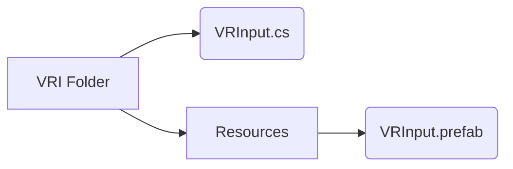

# VR Input

This is a simple package that will get you Vive wand input from **OpenVR**.

The script will give you all the inputs you need, like **VRInput.LeftTriggerMagnitude** or **VRInput.RightGripDown**.
Remember to add **using VRI;** at the top of whatever script you are working in to use it.

You can edit the prefab settings to change the thresholds of what is considered to activate the **trigger**.

The only changes this script will do to your Unity project, is adding more entries to the **Input Manager**.